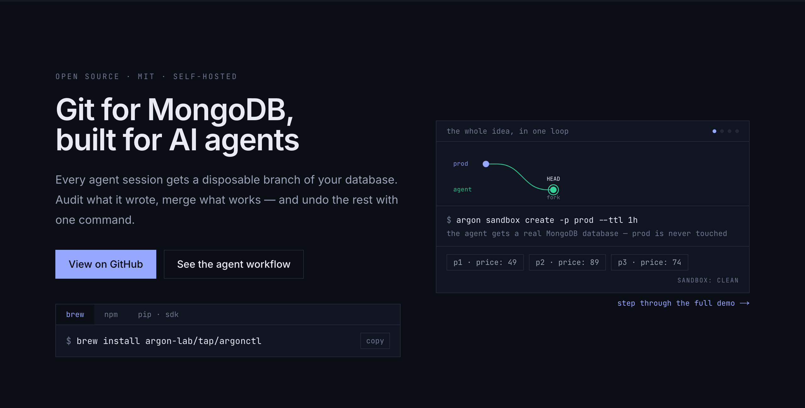

# Argon — Git for MongoDB

<p align="center">
  <a href="https://argonlabs.tech">
    
  </a>
</p>

[](https://github.com/argon-lab/argon/actions/workflows/ci.yml)
[](https://goreportcard.com/report/github.com/argon-lab/argon)
[](https://opensource.org/licenses/MIT)
[](https://github.com/argon-lab/homebrew-tap)
[](https://www.npmjs.com/package/argonctl)
[](https://pypi.org/project/argon-agents/)

**Branch, time-travel, merge and undo your MongoDB. Any driver, real mongod,
versioned history underneath. Built for AI agents.**

Three ideas, thirty seconds:

1. **A branch is a pointer, not a copy** — created in milliseconds at any
   data size.
2. **`checkout` turns a branch into a real MongoDB database** — pymongo,
   mongoose, mongosh, indexes, aggregation, transactions: all real, and
   every write becomes versioned history.
3. **Nothing is ever lost** — diff it, merge it, undo it, rewind it, or pin
   it forever.

## Install

```bash
brew install argon-lab/tap/argonctl      # macOS
npm install -g argonctl                  # cross-platform

# MongoDB must run as a replica set (one-node is fine):
docker run -d --name argon-mongo -p 27017:27017 mongo:7 --replSet rs0
docker exec argon-mongo mongosh --quiet --eval 'rs.initiate()'
```

## The flow

```
main ──branch──▶ experiment ──checkout──▶ mongodb://…  ← any driver
                                              │
                     ┌── argon diff ──────────┤  every write captured
                     ▼                        ▼
        merge (a data PR)          or   undo / discard / rewind
```

```bash
# 0 · Bring your data in ("git clone") — or: argon projects create myapp
argon import database --uri mongodb://localhost:27017 --database myapp --project myapp

# 1 · Branch — instant, no copy
argon branches create experiment -p myapp

# 2 · Get a real database for it, capture writes
argon checkout -p myapp -b experiment      # prints a connection string
argon watch    -p myapp -b experiment      # keep running while you write

# 3 · Review and merge back — a data pull request
argon diff          -p myapp -b experiment
argon merge preview -p myapp -b experiment
argon merge apply <plan-id>

# …or rewind instead of merging
argon restore reset -p myapp -b main --time 2026-07-07T09:00:00Z --backup pre-incident
```

Prefer clicking? `argon console` serves a local web console (UI + REST API)
and opens your browser.

## What you get

| | Command | In one line |
|---|---|---|
| **Branching** | `argon branches create` | a metadata write — instant, zero copy |
| **Real databases** | `argon checkout` / `argon proxy` | any driver, real mongod; proxy serves stable `mongodb://host/<project>~<branch>` URIs |
| **Write capture** | `argon watch` | change-stream → versioned history, per-actor attribution |
| **Time travel** | `argon time-travel query` | any historical state, by LSN or timestamp |
| **Undo** | `argon undo --actor <a>` | revert a range or one writer's changes; append-only, conflict-aware |
| **Restore** | `argon restore preview/reset/branch` | rewind a branch or fork history; recorded, never destructive |
| **Data PRs** | `argon merge preview/apply` | three-way merges as reviewable plans; conflicts never silent |
| **Sandboxes** | `argon sandbox create --ttl 1h` | fork + checkout + TTL in one step — disposable agent workspaces |
| **Dataset pins** | `argon pin create` / `pin sandbox` | immutable named states that survive GC and resets — reproducible evals |
| **Web console** | `argon console` | local UI + REST API in one command |

Storage stays bounded: snapshots + retention-window GC keep state plus a
window of history, not every write forever. Details and the consistency
model, stated honestly: [ARCHITECTURE.md](docs/ARCHITECTURE.md).

## For AI agents

```bash
claude mcp add argon -- argon mcp        # 13 tools: sandbox, diff, merge, undo, pins
pip install argon-agents                 # LangGraph checkpointer + Mem0, over REST
```

```python
saver = ArgonCheckpointSaver.from_sandbox(argon, "myapp")   # checkpoint on a disposable branch
saver.merge()                                               # adopt the run — or .discard()

argon.create_pin("myapp", "eval-v1")                        # pin the dataset once
run = argon.sandbox_from_pin("myapp", "eval-v1")            # identical state, every eval run
```

The full agent workflow: [docs/AGENTS.md](docs/AGENTS.md).

## Documentation

| | |
|---|---|
| [Quick start](docs/QUICK_START.md) | install → first merge, step by step |
| [CLI reference](docs/CLI.md) | every command |
| [Agents](docs/AGENTS.md) | sandboxes, pins, MCP, REST API, argon-agents, proxy |
| [Architecture](docs/ARCHITECTURE.md) | how it works and what it guarantees |
| [Operations](docs/OPERATIONS.md) | deployment, chunk stores (S3/FS), GC, v1→v2 migration |
| [Performance](docs/PERFORMANCE.md) | every number lives in the [reproducible benchmarks](https://github.com/argon-lab/benchmarks) — none here, by policy |

## Community

[Issues](https://github.com/argon-lab/argon/issues) ·
[Discussions](https://github.com/argon-lab/argon/discussions) ·
[Contributing](CONTRIBUTING.md) ·
[argonlabs.tech](https://argonlabs.tech) ·
[Blog](https://argonlabs.tech/blog)

---

<div align="center">

**Give your MongoDB a time machine. Branch without fear.** ⭐

</div>
